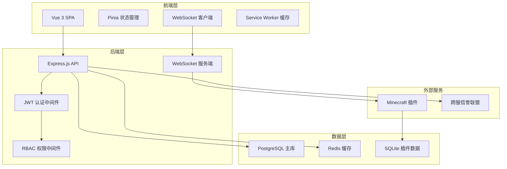
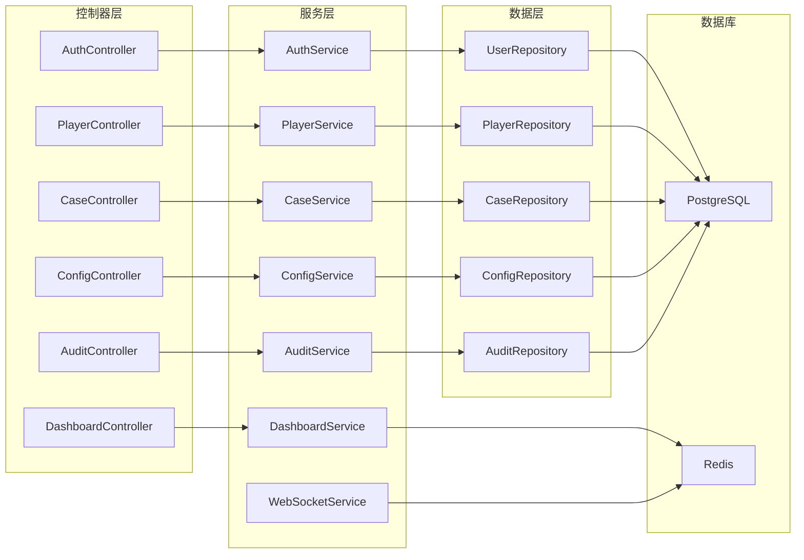
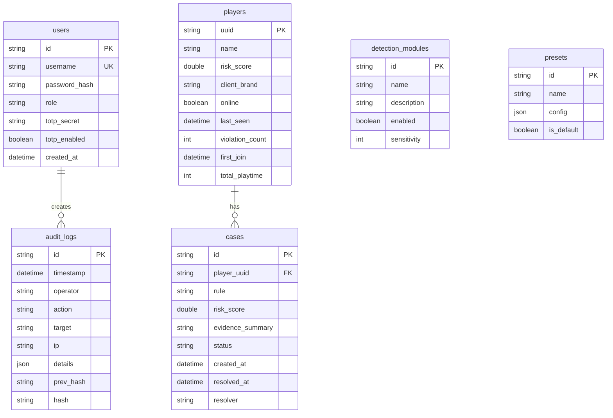

# 反作弊指挥中心 Web 面板技术架构

## 1. 架构设计



## 2. 技术描述
- **前端**: Vue 3 + Vite + TypeScript + Pinia + Tailwind CSS
- **初始化工具**: vite-init (vue-express-ts 模板)
- **后端**: Express.js 4 + TypeScript
- **数据库**: PostgreSQL (主库) + Redis (缓存/会话)
- **实时通信**: WebSocket (Socket.IO)
- **认证**: JWT + Speakeasy (TOTP)
- **图表**: ECharts
- **地图**: Leaflet
- **3D回放**: Three.js

## 3. 路由定义
| 路由 | 用途 |
|------|------|
| /login | 登录页，认证入口 |
| /dashboard | 智能仪表盘首页 |
| /players | 玩家管理中心 |
| /players/:uuid | 玩家详情页 |
| /map | 实时战场地图 |
| /cases | 案件审判中心 |
| /replays | 回放档案列表 |
| /replays/:id | 回放播放器页 |
| /config | 配置中心 |
| /ai-lab | AI实验室 |
| /audit | 审计日志 |
| /reputation | 跨服信誉联盟 |

## 4. API 定义

### 4.1 认证 API
```typescript
// 登录
POST /api/auth/login
Request: { username: string, password: string }
Response: { requiresTotp: boolean }

// TOTP验证
POST /api/auth/totp
Request: { username: string, code: string }
Response: { accessToken: string, refreshToken: string, user: User }

// 刷新令牌
POST /api/auth/refresh
Request: { refreshToken: string }
Response: { accessToken: string }

// 获取当前用户
GET /api/auth/me
Response: User

interface User {
  id: string;
  username: string;
  role: 'super_admin' | 'admin' | 'observer';
  permissions: string[];
}
```

### 4.2 仪表盘 API
```typescript
// 获取仪表盘数据
GET /api/dashboard
Response: DashboardData

interface DashboardData {
  onlinePlayers: number;
  suspiciousCount: number;
  todayBlocked: number;
  pendingCases: number;
  riskDistribution: { safe: number, warning: number, critical: number };
  trends: { time: string, value: number }[];
  recentAlerts: Alert[];
}

interface Alert {
  id: string;
  playerUuid: string;
  playerName: string;
  rule: string;
  severity: 'low' | 'medium' | 'high';
  timestamp: number;
  evidence: string;
}
```

### 4.3 玩家 API
```typescript
// 获取玩家列表
GET /api/players
Query: { riskMin?, riskMax?, client?, online?, country?, page?, limit? }
Response: { players: Player[], total: number }

// 获取玩家详情
GET /api/players/:uuid
Response: PlayerDetail

// 批量操作
POST /api/players/batch
Request: { uuids: string[], action: 'observe' | 'ban' | 'kick' }

interface Player {
  uuid: string;
  name: string;
  riskScore: number;
  clientBrand: string;
  online: boolean;
  lastSeen: number;
  violationCount: number;
}

interface PlayerDetail extends Player {
  firstJoin: number;
  totalPlaytime: number;
  radarData: { movement: number, combat: number, mining: number, inventory: number, aim: number, network: number };
  violations: Violation[];
  relatedAccounts: RelatedAccount[];
}
```

### 4.4 案件 API
```typescript
// 获取案件列表
GET /api/cases
Query: { status?, page?, limit? }
Response: { cases: Case[], total: number }

// 更新案件状态
PUT /api/cases/:id
Request: { status: 'pending' | 'reviewing' | 'resolved', verdict?: 'release' | 'observe' | 'punish' }

interface Case {
  id: string;
  playerUuid: string;
  playerName: string;
  rule: string;
  riskScore: number;
  evidenceSummary: string;
  status: 'pending' | 'reviewing' | 'resolved';
  createdAt: number;
}
```

### 4.5 配置 API
```typescript
// 获取检测模块配置
GET /api/config/modules
Response: DetectionModule[]

// 更新模块配置
PUT /api/config/modules/:id
Request: { enabled?: boolean, sensitivity?: number }

// 获取预设列表
GET /api/config/presets
Response: Preset[]

// 应用预设
POST /api/config/presets/:id/apply

interface DetectionModule {
  id: string;
  name: string;
  description: string;
  enabled: boolean;
  sensitivity: number;
}
```

### 4.6 审计日志 API
```typescript
// 查询日志
GET /api/audit
Query: { startTime?, endTime?, operator?, action?, target?, page?, limit? }
Response: { logs: AuditLog[], total: number }

// 导出日志
GET /api/audit/export
Query: { format: 'csv' | 'json', startTime?, endTime? }
Response: File

// 校验完整性
POST /api/audit/verify
Response: { valid: boolean, suspiciousIds?: string[] }

interface AuditLog {
  id: string;
  timestamp: number;
  operator: string;
  action: string;
  target: string;
  ip: string;
  details: object;
}
```

## 5. 服务端架构图



## 6. 数据模型

### 6.1 数据模型定义



### 6.2 数据定义语言

```sql
-- 用户表
CREATE TABLE users (
    id UUID PRIMARY KEY DEFAULT gen_random_uuid(),
    username VARCHAR(50) UNIQUE NOT NULL,
    password_hash VARCHAR(255) NOT NULL,
    role VARCHAR(20) NOT NULL DEFAULT 'observer',
    totp_secret VARCHAR(255),
    totp_enabled BOOLEAN DEFAULT false,
    created_at TIMESTAMP DEFAULT CURRENT_TIMESTAMP
);

-- 玩家档案表（从插件同步）
CREATE TABLE players (
    uuid UUID PRIMARY KEY,
    name VARCHAR(16) NOT NULL,
    risk_score DOUBLE PRECISION DEFAULT 0.0,
    client_brand VARCHAR(100),
    online BOOLEAN DEFAULT false,
    last_seen TIMESTAMP,
    violation_count INTEGER DEFAULT 0,
    first_join TIMESTAMP,
    total_playtime INTEGER DEFAULT 0
);

-- 案件表
CREATE TABLE cases (
    id UUID PRIMARY KEY DEFAULT gen_random_uuid(),
    player_uuid UUID REFERENCES players(uuid),
    rule VARCHAR(100) NOT NULL,
    risk_score DOUBLE PRECISION,
    evidence_summary TEXT,
    status VARCHAR(20) DEFAULT 'pending',
    created_at TIMESTAMP DEFAULT CURRENT_TIMESTAMP,
    resolved_at TIMESTAMP,
    resolver VARCHAR(50)
);

-- 审计日志表（不可变）
CREATE TABLE audit_logs (
    id UUID PRIMARY KEY DEFAULT gen_random_uuid(),
    timestamp TIMESTAMP DEFAULT CURRENT_TIMESTAMP,
    operator VARCHAR(50) NOT NULL,
    action VARCHAR(50) NOT NULL,
    target VARCHAR(100),
    ip VARCHAR(45),
    details JSONB,
    prev_hash VARCHAR(64),
    hash VARCHAR(64) NOT NULL
);

-- 检测模块配置表
CREATE TABLE detection_modules (
    id VARCHAR(50) PRIMARY KEY,
    name VARCHAR(100) NOT NULL,
    description TEXT,
    enabled BOOLEAN DEFAULT true,
    sensitivity INTEGER DEFAULT 5 CHECK (sensitivity BETWEEN 1 AND 10)
);

-- 预设表
CREATE TABLE presets (
    id UUID PRIMARY KEY DEFAULT gen_random_uuid(),
    name VARCHAR(50) NOT NULL,
    config JSONB NOT NULL,
    is_default BOOLEAN DEFAULT false
);

-- 索引
CREATE INDEX idx_players_risk ON players(risk_score);
CREATE INDEX idx_players_online ON players(online);
CREATE INDEX idx_cases_status ON cases(status);
CREATE INDEX idx_audit_timestamp ON audit_logs(timestamp);
CREATE INDEX idx_audit_operator ON audit_logs(operator);

-- 初始数据
INSERT INTO detection_modules (id, name, description, enabled, sensitivity) VALUES
    ('movement', '移动检测', '检测飞行、加速、穿墙等异常移动', true, 5),
    ('combat', '战斗检测', '检测杀戮光环、自瞄、超距攻击', true, 5),
    ('inventory', '背包检测', '检测非法物品、快速整理', true, 3),
    ('mining', '挖掘检测', '检测非法挖掘模式', true, 4);

INSERT INTO presets (id, name, config, is_default) VALUES
    (gen_random_uuid(), '竞技模式', '{"movement": 8, "combat": 8, "inventory": 6, "mining": 7}', false),
    (gen_random_uuid(), '生存模式', '{"movement": 5, "combat": 5, "inventory": 4, "mining": 5}', true),
    (gen_random_uuid(), '宽松模式', '{"movement": 3, "combat": 3, "inventory": 2, "mining": 3}', false);

-- 默认超级管理员（密码需要在部署时更改）
INSERT INTO users (username, password_hash, role) VALUES
    ('admin', '$2b$12$placeholder_hash_to_be_changed', 'super_admin');
```

## 7. WebSocket 事件协议

```typescript
// 服务端推送事件
interface WSEvent {
  type: 'alert' | 'risk_update' | 'player_online' | 'player_offline' | 'case_new';
  data: object;
  timestamp: number;
}

// 告警事件
interface AlertEvent {
  type: 'alert';
  data: Alert;
}

// 风险更新事件
interface RiskUpdateEvent {
  type: 'risk_update';
  data: { uuid: string, oldScore: number, newScore: number };
}

// 玩家状态事件
interface PlayerStatusEvent {
  type: 'player_online' | 'player_offline';
  data: { uuid: string, name: string };
}
```