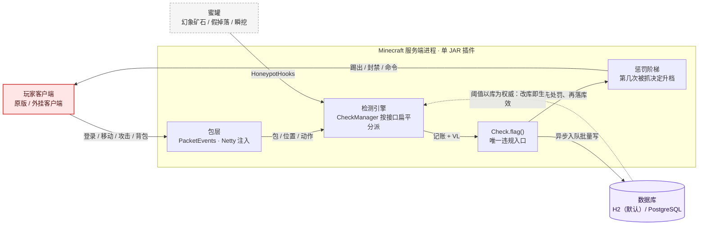

# AdvancedAntiCheat

[](https://github.com/cklsit/AdvancedAntiCheat/actions/workflows/ci.yml)
[](https://cklsit.github.io/AdvancedAntiCheat/)


适用于 **Minecraft 1.8.8 – 1.21.11** 服务端（Paper / Purpur / Spigot / FlamePaper）的高级反作弊插件：**一套源码编译，双版本运行**。

检测引擎**只有一套**：参照 [GrimAC](https://github.com/GrimAnticheat/Grim) 的 **Grim 式内核**（`com.anticheat.core`，Kotlin + PacketEvents）。
旧的三层事件引擎与贝叶斯融合中心已于 **2026-09-25 整体移除**：它自带一套与核心层**并行**的阈值与封禁逻辑，
而线上那次误封（带迅捷效果的正常跑步被判"速度作弊"、自动封禁 30 分钟）正出在它身上——**两套处罚语义并存本身就是最大的缺陷来源**。

- 🧠 **单一判定链路**：包层 → `CheckManager` 分派 → `Check.flag()` **唯一违规入口** → 违规落库 → 惩罚阶梯；不存在第二条处罚路径
- 🕵️ **25 项检测**：非法数据包 / 计时器 / 自动点击 / 瞄准 / 伸手 / 战斗动作 / 背包窗口 / 移动 / 世界交互 / 蜜罐（`core.checks.<名字>` 逐项开关与调参）
- 👤 **玩家画像系统**：瞄准分析、挖矿模式、背包状态机、击键动力学、身份指纹、风险历史
- 🔐 **三套人工介入机制**：查端（客户端核实）、验证码（专用世界任务 + 动作模仿 DTW 判定）、漏洞赏金（白盒自测沙箱）
- 🌐 **持久化与跨服**：H2（默认，嵌入式零运维）/ PostgreSQL（可选），配合 BungeeCord / Velocity 全服生效
- 🧩 **游戏内管理界面**：`/ac config` 多级箱子菜单，检测项开关 / 数据库 / 白名单 / 封禁管理全部游戏内完成并热更新
- 📝 **审计留痕**：每一次处罚动作（踢出 / 临时封禁 / 命令）都写入 `audit_log`，且违规行如实记录"这条违规导致了什么处罚"（`violation.punished`）

---

## 🏗️ 架构总览


> 上图由 [archify](https://github.com/tt-a1i/archify) 从仓库真实代码生成，锚定提交 `5ae02ab`，含 13 处源码引用。
> （该提交下线了观察者回放与 Web 面板，图已同步移除「管理面板」「观察者容器」节点。）
>
> 🔎 **在线交互版**：<https://cklsit.github.io/AdvancedAntiCheat/architecture/anticheat-runtime-architecture.html>
> —— 可缩放 / 平移 / 搜索节点 / 追踪关系 / 切换深浅主题 / 导出 PNG·SVG（由 GitHub Pages 从 `docs/` 发布，[落地页](https://cklsit.github.io/AdvancedAntiCheat/)）
>
> 其余产物在 [`docs/architecture/`](docs/architecture/)：
> [JSON 规格](docs/architecture/anticheat-runtime-architecture.json)（可复现渲染）·
> [深色版 PNG](docs/architecture/anticheat-runtime-architecture-dark.png)
>
> GitHub 的 Markdown 清洗器只放行 `img / table / details` 等少量标签，`script`、`style`、`iframe`、`svg`、`picture` 均会被剔除，
> 因此交互版 HTML **无法直接嵌进 README**（只能外链）。下面折叠区是用 GitHub 原生 Mermaid 渲染的等价版本，可在页面内直接放大查看。

<details>
<summary>📐 原生渲染版架构图（GitHub 直接绘制 · 可点击放大 · 随深浅主题切换）</summary>



</details>

**主链路（唯一一条运行时路径）**

```
玩家数据包 → PacketEvents 包层 → CheckManager 分派 → Check.flag() → 违规落库 + 惩罚阶梯
```

| 阶段 | 关键实现 | 要点 |
|------|---------|------|
| 包层 | `core/events/packets/`（内嵌 PacketEvents 2.13.0） | 注入 Netty，按领域分 tracker；**不依赖 ProtocolLib、不依赖服务端版本分支** |
| 分派 | `CheckManager` | 构造时按接口把检测切成扁平数组，位置/朝向回调每包触发，因此不做反射或 `instanceof` |
| 判定 | `Check.flag(verbose, amount)` | **唯一违规入口**：开关 → 豁免 → 事件否决 → 记账 → 处罚决策 → 落库，五处门控都在这一处 |
| 落库 | `ViolationRecorder`（有界队列 + 攒批 + 事务） | 队列满**丢弃并计数**，绝不阻塞主线程/收包线程 |
| 处罚 | `PunishmentManager` + `LadderPolicy` | 升档依据是**第几次被抓**（跨会话，数 `violation.punished`），VL 只决定"够不够格" |
| 蜜罐 | `HoneypotListener` → `HoneypotHooks` → `HoneypotA` | 蜜罐命中不是包驱动，因此走**按名字取检测实例**的外部入口，仍然落到同一条 `flag` 链路 |

**外部依赖与信任边界**

| 类型 | 对象 | 现状 |
|------|------|------|
| 🔴 信任边界 | 玩家客户端（全部输入不可信） | 包层解析 + 非法数据包检测；白名单挂 `anticheat.bypass` 附件全局豁免 |
| 🟠 外部系统 | 数据库 | `database.type`：`h2`（默认，嵌入式）/ `postgresql`（多服共用）；库不可用时**降级不落库**，游戏不受影响 |
| 🟠 外部系统 | 代理服 | 软依赖 BungeeCord / Velocity，实现跨服封禁同步 |
| 🟠 外部系统 | ProtocolLib | **不再需要**：包级能力自带（旧引擎的 ProtocolLib 钩子已随其移除） |

---

## 📋 前置依赖

插件启动时自动探测服务器版本，在 1.8.x 与 1.19+ API 之间选择兼容模式运行：

| 服务器类型 | 最低版本 | 推荐 / CI 验证版本 |
|-----------|---------|------------------|
| Paper / Purpur | 1.19+ | 1.21.11 |
| Spigot / FlamePaper | 1.8.x | 1.8.8 |

| 软依赖 | 说明 |
|--------|------|
| BungeeCord / Velocity | 跨服务器消息通道，用于跨服封禁同步与 `/goto` |
| ProtocolLib | 协议级检测（非法数据包结构、微时序、假方块）；未安装时相关检测自动降级，插件照常运行 |

---

## 🚀 安装方法

1. 下载最新版插件 JAR（[Releases](https://github.com/cklsit/AdvancedAntiCheat/releases)）
2. 将 JAR 放入服务端 `plugins` 目录
3. 启动服务器，插件自动生成配置：
   - `plugins/AdvancedAntiCheat/config.yml` — 主配置（检测项 / 数据库 / 验证码 / AI 实验室）
   - `plugins/AdvancedAntiCheat/checkclient.yml` — 查端文案
   - `plugins/AdvancedAntiCheat/messages.yml` — 玩家侧全部消息
4. 改完执行 `/ac reload`（**不要用 Bukkit `/reload`**：它会踢所有玩家下线）

---

## ✨ 功能特性

### 🔍 检测体系

检测项清单见下面「核心层」一节（共 25 项，`core.checks.<名字>` 可逐项开关与调参）。
**旧引擎的八大类检测项与其 `detection.*` 配置键已于 2026-09-25 一并移除**，理由写在
[架构总览](#-架构总览) 开头：它们与核心层并行判定、各有一套封禁阈值，是误封的直接来源。

仍在独立运行的辅助模块（不含自有的处罚路径）：

| 模块 | 位置 | 说明 |
|------|------|------|
| 玩家画像 | `profiles/` | 行为追踪 / 瞄准分析 / 矿机模式 / 背包状态机 |
| 蜜罐 | `listeners/HoneypotListener` | 幻象矿石 / 假掉落 / 瞬挖 / 假逃脱；命中经 `HoneypotHooks` 上报给核心层 `HoneypotA` |
| 行为分析 | `profiles/BehaviorAnalysisEngine` + `listeners/BehaviorListener` | 站桩比、界面交互异常等（`behavior.*` 配置） |
| AI 实验室 | `ai/` | 48 维特征 / 孤立森林 / 在线 KMeans，输出到 `dataFolder/ailab/`（见下节说明） |
| 验证码 / 查端 / 赏金 | `captcha/` `bounty/` | 人工介入与白盒自测沙箱 |

### 🧬 核心层（`com.anticheat.core`）—— Grim 式内核

参照开源反作弊 [GrimAC](https://github.com/GrimAnticheat/Grim) 重构的内核，**Kotlin 编写**，是**唯一**的检测引擎
（旧的三层事件引擎已于 2026-09-25 整体移除）。`core.enabled=false` 会**整体停用检测**，插件仍可加载并保留数据库/审计等外围能力。

- **包层**：内嵌 PacketEvents 2.13.0，注入 Netty 通道，**一个 jar 覆盖 1.8.8 – 1.21.x**，不依赖 ProtocolLib 或服务端版本分支
- **分派**：`CheckManager` 在玩家接入时按接口类型把检测切成扁平数组，位置/朝向回调不做任何反射或 `instanceof`
- **检测框架**：`@CheckData` 注解携带「名字 / 衰减 / setback 阈值」，新增检测不需要改注册代码；`flag()` 是唯一违规入口
- **违规账本**：`ViolationData` 不依赖任何平台类型，可离线单测（`ViolationDataTest`）——`flag` 加分、`reward` 按 decay 扣分，保证真人分数能回落
- **失败即降级**：包层注入失败（非标准 Netty 管道、其它注入型插件冲突）时插件整体仍可用，但**检测不参与判定**——这是一条必须在日志里看得见的告警，而不是静默失效

内置 25 项检测（`core.checks.<名字>` 可逐项开关/调参）：

| 分组 | 检测 | 判据 |
|------|------|------|
| 协议 | `BadPacketsA` | 非法位移（NaN/Inf、单包位移超物理上限） |
| 协议 | `BadPacketsB` | 非法 pitch（越界 / NaN） |
| 协议 | `BadPacketsC` | 松开右键包携带非法作用面（原版恒为 DOWN） |
| 协议 | `BadPacketsD` | 连续上报相同手持槽位（原版只在变化时才发） |
| 背包 | `InventoryA` | 服务端未开窗却点击容器 |
| 背包 | `InventoryB` | 拾取后 100ms 内换入副手（自动图腾，1.9+） |
| 计时 | `TimerA` | 移动包持续快于原版（计时器加速，余额法） |
| 计时 | `TimerB` | 移动包连续长间隔（客户端攒包 / blink） |
| 自动点击 | `AutoClickerA` | 点击间隔标准差长期过低且稳定（1.13 以下） |
| 自动点击 | `AutoClickerB` | 点击间隔香农熵过低（1.13 以下） |
| 自动点击 | `AutoClickerC` | 每秒攻击次数**达到**上限即违规；单 tick 多次攻击加重 |
| 自动点击 | `AutoClickerD` | 连续多个 tick 不间断发送攻击包（机械连击 / KillAura 连发）——不依赖客户端时序，**全版本生效** |
| 瞄准 | `AimA` | 攻击期间朝向增量过于均匀（机械瞄准 / 平滑 aimbot） |
| 瞄准 | `AimB` | 对准移动目标长期百发百中（命中率，实验性：需 `experimental-checks`） |
| 瞄准 | `AimC` | 单帧把准星瞬移到目标（snap aim）——补 `AimA` 只抓平滑瞄准、抓不到暴力瞬转的盲区 |
| 射线 | `ReachA` | 攻击距离超原版上限（按延迟动态容差 + 8 tick 延迟补偿，只累积不单次判定） |
| 射线 | `ReachB` | 攻击了完全不在视线内的实体（无视线攻击 / silent aura） |
| 战斗 | `NoSwingA` | 攻击了却没有挥手包（silent aura） |
| 战斗 | `ToolSwitchA` | 挖掘开始后 1 tick 内切换手持（自动换工具） |
| 移动 | `FlyA` | 空中垂直运动不满足重力递推（悬停 / 匀速上升式飞行） |
| 移动 | `GroundSpoofA` | 声称落地却在快速下坠，且脚下无支撑（NoFall 免摔） |
| 移动 | `SprintA` | 疾跑时位移方向偏离朝向超 75 度（全向疾跑 / KeepSprint） |
| 移动 | `SpeedA` | 水平速度持续超物理上限（Speed / LongJump，实验性：需 `experimental-checks`） |
| 移动 | `SpeedB` | 滑动窗口**平均**速度持续超上限（持续超速，默认启用；单拍极值不可用，见其类注释） |
| 移动 | `InventoryMoveA` | 容器窗口打开期间自主移动（InventoryMove） |
| 世界 | `BreakRestartA` | 同一方块被反复重启挖掘（fastbreak / nuker） |
| 世界 | `FastPlaceA` | 同 tick 多次放置 / 每秒放置次数超限（fastplace） |
| 世界 | `NukerA` | 同 tick 对多个方块下手 / 挖掘不在视线内的方块（nuker） |

配置见 `config.yml` 的 `core:` 段。详见 [CODE_WIKI 3.7](CODE_WIKI.md#37-核心层core--grim-式内核)。

### 🧠 概率融合与智能决策（已移除）

> **2026-09-25 移除**：`ProbabilityFusionEngine` / `BayesianNetwork` / `RCPComputer` /
> `AdaptiveLearningSystem` / `DecisionActionCenter` / `PerformanceMonitor` 随旧引擎一并删除。
>
> 原因不是"不好用"，而是**结构性问题**：融合中心携带自己的一套处罚阈值与动作档位
> （五档 ActionLevel），与核心层的惩罚阶梯并列存在。同一个玩家在两条路径上会被两套不同的
> 规则处置，而排查误封时必须同时读两份逻辑——这正是线上误封发生第二次的原因（同一玩家两天内被封两次）。
>
> 现在处罚只有一处：`PunishmentManager` + `LadderPolicy`，升档依据是**第几次被抓**（跨会话），
> 证据门槛是 `punishment_ladder.min_vl`，全在数据库里可见、可改、可审计。

### 🤖 AI 实验室（`com.anticheat.ai`）

48 维特征工程 → KMeans 个人基线 + 孤立森林全局异常 + 监督学习闭环 + PID 自适应阈值；
`ailab.enabled=false` 即退回纯规则模式，数据落在 `dataFolder/ailab/`。

> ⚠ **本轮变化**：AI 实验室原先通过 `AdvancedDetectionManager.updatePlayerRCP` 把融合分回注到旧引擎的
> RCP 链路，该入口随旧引擎删除后**不再被调用**——现在它是**纯分析**（特征、基线、异常分照常计算与落盘，
> 不参与处罚）。若要让它重新参与判定，需要接一条到核心层的入口（见「下一步」）。

### 👤 玩家画像（profiles）

每位玩家维护长期档案：移动 / 战斗 / 挖矿 / 背包 / 社交五大行为特征、身份指纹（历史 ID / IP / 客户端版本 / 语言 / 硬件）、账号关联图与风险历史（每小时衰减），可在游戏内 GUI（`/ac profile`）查看。

另有四个由 `BehaviorTracker` 持有的长程分析器，产出描述性指标并在行为异常日志中输出「画像上下文」：

| 分析器 | 数据来源 | 输出 |
|--------|----------|------|
| `AimAnalysis` | `PlayerMoveEvent` 朝向增量 + `CombatDetectionModule` 命中 | 转向平滑度、增量方差、命中数 |
| `TimerDetection` | `PlayerAnimationEvent` 挥手时刻 | 平均间隔、离散系数 |
| `MiningPatternAnalyzer` | `BlockDamageEvent`→`BlockBreakEvent` 单次破坏耗时 | 平均耗时、离散系数 |
| `InventoryStateMachine` | 背包点击 / 容器开关 / 副手切换 | 转移总数与类型分布 |

> ⚠️ **这四个分析器只作上下文展示，不参与违规判定。** 它们的 `isAimbot()` / `isTimerAnomaly()` / `isAutoMiner()` / `isAutoTotem()` 阈值从未在真机标定过，且在样本不足时会朝「命中」方向失效（`stdDev` 缺省 `0.0 < 阈值`，等于新玩家一律被判矿机）。行为由 `ProfileAnalyzerGuardTest` 锁定；接进违规链前必须先过 `hasEnoughData()` 并重新标定阈值。

`InventoryStateMachine` 不回报 `TOTEM_SWAP`：判定副手物品需要 1.9+ 的 offhand API，而 `InventoryDetectionModule` 必须在 1.8 上整体注册成功，因此 `isAutoTotem()` 在当前接线下恒为 `false`。

### 🧩 验证码系统

- `/captcha <玩家|toggle|timelimit>` — 对玩家发起验证码测试，支持新玩家自动验证
- 玩家进入**专用验证码世界**（自定义 chunk generator），从 `captcha.tasks.*` 启用的题库中**随机抽 1 项**：
  - `TypeA_DirectInteraction` — 注视指定颜色的羊 + 潜行
  - `TypeB_MotionMimicry` — 随机 3~4 步动作序列（跳跃 / 左右转 / 疾跑 / 潜行，不连续重复），按序号打在聊天框，由 `DtwMatcher`（DTW）对齐判定，**只看做了哪些动作与顺序，时长不参与**
- 判定通过即放行；失败会重新出题，连续失败达阈值由决策中心升级处置
- 动作识别阈值刻意放宽（`min-action-ms 150` / `turn-commit-degrees 30` / `min-move-blocks 0.5`），宁可放过误触也不误杀真人

### 🔐 查端系统（客户端核实）

- `/checkclient <玩家> <QQ号>` — 开始客户端检查，被检玩家限制移动 / 交互 / 指令 / 聊天、施加失明、显示自定义标题与聊天消息
- `/checkdone <玩家>` — 结束检查（通过）
- 超时或中途退出 → 自动永久封禁
- 文案、超时时间全部可在 `checkclient.yml` 自定义（支持 `{vault_group}` `{admin}` `{qq}` `{timeout}` 变量）

### 💰 漏洞赏金系统（白盒自测沙箱）

定位是**化敌为友**：与其让外挂作者在暗处破坏，不如给一个光明正大的渠道把成果上交换奖励。
玩家在完全隔离的 `bounty_world` 里"表演"，插件只记录、不惩罚。

| 任务 | 目标（**不作弊做不到**才有判据价值） | 时长 | 赏金 |
|------|--------------------------------------|------|------|
| `move-basic` | 30 秒内从 A 点到达 B 点，全程不得落地 | 5 分钟 | 10 |
| `move-advanced` | 空中完成一次直角变向（离地 ≥10 tick 且偏航变化 ≥60°） | 5 分钟 | 50 |
| `combat-basic` | 10 秒内击杀全部 5 个持续移动的傀儡 | 3 分钟 | 10 |
| `combat-advanced` | 对不可见幽灵实体保持准星锁定累计 3 秒 | 5 分钟 | 100 |
| `inventory-challenge` | 3 秒内完成 8 次背包交互 | 3 分钟 | 30 |
| `free-test` | 无目标：自由尝试，出现未记录的异常模式即判高危 | 10 分钟 | 150 |

**判定结果（四种，`INCONCLUSIVE` 是必备状态）**

| 结果 | 含义 | 赏金 |
|------|------|------|
| `DETECTED` | 触发了仍在运行的检测打分 → 说明现有规则有效 | 保底 1 |
| `BYPASSED` | 完成目标且全程未被检测识别（异常分 ≥ 绕过线为中置信） | 任务赏金 × 倍率 |
| `ZERO_DAY` | 完成目标 + 多维行为显著偏离人类基线 | 500 |
| `INCONCLUSIVE` | 既没完成目标也没被抓到 → **没有信息量，不发赏金** | 0 |

**三条关键机制**

1. **沙箱内关闭自动惩罚，但检测照常打分**。用独立的 `PlayerData.sandbox` 标记实现
   （**不是** `exempt`——后者会让 `Check.flag` 第一行就返回、检测完全不跑，
   沙箱拿不到任何证据，于是每次任务都只能判绕过）。
2. **背包自动暂存与归还**。进入前用 `CaptchaInventoryBackup` 采集快照再清空，
   离开时用快照覆盖——同时完成"销毁沙箱内所得"与"归还原物"。原实现只清不还，
   玩家执行一次 `/bounty enter` 就永久丢光全部家当。
3. **每日额度按 (玩家, 天) 落库**，跨天自动重置。原实现用一个只增不减的内存累加器，
   于是"每天 30 分钟"实际是"累计 30 分钟后永久无法再进"。

**赏金代币**：只兑换**不影响平衡**的东西（称号权限、击杀粒子、纪念品），
绝不卖装备与材料——否则赏金计划会退化成"用外挂刷代币"。商城 `/bounty shop`。

**案例审核**：绕过/高危发现进入 `bounty_case`（`pending`），由管理员
`/bounty accept|reject <ID>` 审核。沙箱数据**不会自动**流入生产规则
（文档要求的"特征库污染防护"）。证据包落在 `plugins/AdvancedAntiCheat/bounty-evidence/`
（事件时间线 + 逐 tick 采样 CSV + 指标与基线对比摘要）。

**人类基线**：由**主世界玩家**（非沙箱）以 10 秒为一个不重叠窗口提供观测，
按指标累计均值/标准差并落库（`bounty_baseline`）。基线未就绪时判定会**显式回落**
成"只看检测证据"并标注低置信度，而不是把"我们不知道"当成"他很清白"。

**自动调参（默认关闭）**：判定出一次**可信的**绕过时，可以自动把最相关的检测阈值
收紧一小步并热生效——不需要人工改配置文件。它被刻意约束成：

- 只吃 **MEDIUM 及以上**置信度。LOW 档只有"完成目标"这一项证据，而任务目标本身
  可能人肉就能完成（如「10 秒杀 5 个傀儡」），拿它驱动调参 = 把"玩得好"当成"检测不够严"；
- 只调 `check_rule.thresholds` 里的**数值**，不碰判定逻辑；只降不升，一次最多 10%；
- 不得越过各检测声明的 `autoTuneFloor` —— 该下限与 `CombatCheckThresholdsTest` /
  `MovementCheckThresholdsTest` 的不变量**同源**，所以自动调参不可能把判据推到
  违反不变量测试的地方；
- 改动后有观察期（默认 6 小时），该检测违规量超过基线 3 倍即**自动回滚**并进入 7 天长冷却。

归因（回答"该调哪个检测"）靠把证据逐 tick 重放给各判据的**同一个纯逻辑实现**，
所以只覆盖判据已纯逻辑化的检测（`AimC` / `AutoClickerD` / `SpeedB`）；
`ReachA` / `FlyA` / `NukerA` 这类依赖实体位置与方块的判据无法离线重放，仍走人工闸门。

⚠ 它是一条**可被反向利用的回路**：作弊者能故意触发绕过、把某个检测的阈值一路推低，
直到正常玩家开始被误报。上面那几条约束就是为此存在的。因此默认
`enabled: false` + `shadow: true`（只记录"本来会改成什么"，不写库）——
**建议先空跑一到两周**再决定是否启用。配置见 `config.yml` 的 `bounty.auto-tune`。

### ⚖️ 封禁与举报

- 按违规严重程度自动封禁（临时 1 分钟 ~ 永久），支持踢出阈值与人工审核升级阈值，封禁界面可在 `messages.yml` 自定义
- `/report <玩家> <原因>` — 玩家举报，管理员收到**带「前往举报者」按钮**的通知，举报记录可用 `/ac reports` 查看

### 🛠️ 游戏内配置界面

`/ac config` 提供多级箱子菜单：在线玩家列表、玩家详情（封禁 / 查证 / 发送验证码）、封禁名单与解封均可游戏内完成；`anticheat.whitelist` 持有者可在同一界面维护可信白名单（白名单玩家不做反作弊封禁）。

---

## 📖 指令说明

### 玩家指令

| 指令 | 说明 | 权限 |
|------|------|------|
| `/report <玩家> <原因>` | 举报作弊玩家 | `anticheat.report`（默认开放） |
| `/bounty enter\|board\|shop\|start\|status\|rank\|cases\|report\|leave` | 漏洞赏金计划 | `anticheat.bounty`（默认开放） |
| `/ac ranking` | 赏金猎人排行（所有玩家可用） | `anticheat.command`（默认开放） |
| `/ac` / `/anticheat` | 查看插件信息与帮助 | `anticheat.command`（默认开放） |

### 管理员指令

| 指令 | 说明 | 权限 |
|------|------|------|
| `/ban <玩家> [时间] [原因]` | 封禁玩家（默认永久，跨服同步） | `anticheat.ban` |
| `/unban <玩家>` | 解封玩家 | `anticheat.unban` |
| `/goto <玩家>` | 传送至指定玩家（支持跨服） | `anticheat.goto` |
| `/checkclient <玩家> <QQ号>` | 开始客户端检查 | `anticheat.checkclient` |
| `/checkdone <玩家>` | 结束客户端检查（通过） | `anticheat.checkclient` |
| `/captcha <玩家\|toggle\|timelimit>` | 验证码测试 | `anticheat.captcha` |
| `/bounty pending` / `accept\|reject <ID>` / `invite <玩家>` | 赏金案例复核与邀请 | `anticheat.bounty.admin` |
| `/ac reload` | 重新加载配置 | `anticheat.admin` |
| `/ac stats` / `/ac reports` | 检测统计 / 待处理举报 | `anticheat.admin` |
| `/ac profile <玩家>` | 查看玩家档案 GUI | `anticheat.admin` |
| `/ac config` | 游戏内管理界面 | `anticheat.config` |
| `/ac help` | 列出全部命令 | `anticheat.admin` |

> 注意：Paper 1.8.8 控制台执行命令**不能带前导斜杠**（写 `ac help` 而非 `/ac help`）。

## 🔐 权限节点

| 权限 | 说明 | 默认值 |
|------|------|--------|
| `anticheat.report` | 使用举报功能 | ✅ true |
| `anticheat.command` | 使用 `/ac` 的公开子命令（如 `ranking`）；管理子命令仍要求 `anticheat.admin` | ✅ true |
| `anticheat.bounty` | 使用漏洞赏金 | ✅ true |
| `anticheat.bounty.admin` | 赏金计划管理员 | 🔒 op |
| `anticheat.bounty.unlimited` | 无限制沙箱时间 | 🔒 op |
| `anticheat.goto` | 传送至玩家 | 🔒 op |
| `anticheat.ban` / `anticheat.unban` | 封禁 / 解封 | 🔒 op |
| `anticheat.checkclient` | 客户端检查 | 🔒 op |
| `anticheat.captcha` | 验证码功能 | 🔒 op |
| `anticheat.admin` | 反作弊管理员 | 🔒 op |
| `anticheat.notify` | 接收举报通知 | 🔒 op |
| `anticheat.config` | 游戏内配置界面 | 🔒 op |
| `anticheat.whitelist` | 维护可信白名单 | 🔒 op |

---

## 🗄️ 数据持久化（H2 / PostgreSQL）

反作弊的运行时状态全在内存里，**持久化只用于"事后能查"**：玩家档案、IP 记录、封禁、
违规明细、规则阈值、统计口径。数据库不可用时插件**照常判定与告警**，只是不再落库
（日志一条 WARN、不打堆栈），并按 `reconnect-delay-seconds` 自动重连。

两个后端，**共用同一套表结构与 SQL**（时间列是 BIGINT epoch 毫秒、IP/CIDR 用字符串、
网段匹配在插件内做），因此切换后端不需要改任何代码，也不会出现"某个后端少一列"：

| 后端 | 定位 | 说明 |
|------|------|------|
| `h2`（默认） | 嵌入式、零运维、保底 | 库文件在 `plugins/AdvancedAntiCheat/anticheat-v2.mv.db` |
| `postgresql` | 外置、多服共用、可直接用 SQL 看板 | 需要先有 PG 实例（插件只连库，不装库） |

```yaml
database:
  type: "h2"                 # h2 | postgresql
  server-name: "Server-1"    # 写进 ban / violation 的子服名（多服共用一套库时区分来源）
  h2:
    path: "anticheat-v2"
  postgres:
    host: "127.0.0.1"
    port: 5432
    database: "anticheat"
    username: "anticheat"
    password: ""
    pool-size: 4
  auto-migrate: true         # 建表/升级由插件做（schema_version 记录版本，幂等）
  violation:                 # 违规是最高频写操作：攒批 + 异步入队，队列满则丢弃并计数
    batch-size: 64
    flush-interval-ms: 5000
    queue-capacity: 4096
  stats:
    bucket-minutes: 5        # 检查命中率统计桶
    risk-refresh-minutes: 10 # 风险分重算周期
  ip-intel:                  # 离线 IP 情报（按网段给 ASN/国家，插件不做任何外部查询）
    rules:
      - cidr: "10.0.0.0/8"
        asn: 0
        org: "LAN"
        country: "LAN"
```

### 表结构

| 表 | 内容 |
|----|------|
| `player_profile` | UUID、当前名、首次/最后登录、最后 IP、会话数、在线时长、风险分、近 24h/7d 违规数、行为画像 blob |
| `player_name` | 用户名历史（可按旧名反查账号，小号识别的基本手段） |
| `player_ip` | 玩家用过的每个地址：地址族、归并网段（IPv4 /24、IPv6 /64）、ASN、国家、首末时间、登录次数 |
| `ban` | UUID / IP / CIDR 封禁 × 临时 / 永久 × `active` / `expired` / `revoked`，含原因、执行者、时间、过期、撤销信息 |
| `violation` | 检测名、VL、增量、严重度、时间、子服、世界、坐标、ping、TPS、客户端版本、包类型、verbose |
| `check_rule` | 各检测的开关 / 衰减 / setback / 专属阈值（**库为权威**） |
| `punishment_ladder` | 惩罚阶梯：按 VL 分档的动作（`alert` / `kick` / `ban` / `command`）与时长 |
| `whitelist_entry` | 白名单（命中即豁免检测），支持按 UUID 或名字匹配（**大小写不敏感**），可带到期时间 |
| `check_stat` / `risk_snapshot` | 检查命中率（真实的 flags/evaluations 桶）、风险分历史 |
| `audit_log` | 审计日志（查询口径与旧实现保持一致） |

视图：`v_violation_trend`（按天 × 检测）、`v_check_hit_rate`（真实的 flags/evaluations）、
`v_player_risk`。三类视图都不含时间函数，所以两个后端共用同一份定义；
"当前生效的封禁"要走仓储（带时间参数的查询），不在视图里表达。

### 规则以数据库为权威

`check_rule` 在启动时登记**代码里的事实**（描述、是否实验性）与首次的默认阈值；
之后 `enabled` / `decay` / `setback` / `thresholds` **由数据库说了算**——直接改库即可生效，
`/ac reload` 会重新回灌，不会被 `config.yml` 顶回去（否则管理员调好的阈值会在重启后
被悄悄改掉，且不报错）。

### 惩罚阶梯与白名单

这两张表的口径与 `check_rule` **刻意不同** —— 它们的"权威来源"不一样，混成一个套路会出事：

| 表 | 来源 | 语义 |
|----|------|------|
| `check_rule` | 代码是事实、**库是权威** | 只补缺失项；`enabled`/`decay`/`setback`/`thresholds` 永不回写 |
| `punishment_ladder` | **config.yml 是播种源**；库里非空则以库为准 | 空表时用 `core.punishment.ladder` 播种。想让 config 重新覆盖：清空该表后 `/ac reload` |
| `whitelist_entry` | config 是**补充声明**、库是存储 | 启动/重载把 config 里缺失的条目补进去；已存在的**不动、不删**。撤销要在库里删行，或用 `expires-in` 让它自然过期 |

**升档依据是"第几次被抓"，不是 VL。** 违规分（VL）是会话内的量：被踢下线后重连，
检测实例重建、VL 归零。若按 VL 分档，只要"踢"这一档比"封"低，被踢的人重连后 VL 归零
→ **永远到不了封禁档**（踢—重连—再踢的死循环），阶梯就成了摆设。
所以升档依据是跨会话的计数（`PlayerData.punishmentCount`，登录时数 `violation.punished`
的条数），而 `min-vl` 退化为**该档的证据门槛**：越重的处罚要求越高的 VL。

`LadderPolicy.selectStep(阶梯, VL, 第几次被抓)` 的规则：

1. 只在**前 N 档**里找（N = 第几次被抓；超过档数封顶最后一档）；
2. 在这些档里取"VL 够格"（`VL >= min-vl`）的最高一档；
3. 一档都不够格 → 本次**不处罚**（证据不够就不给处罚）。

所以"第 3 次被抓但 VL 只有 9"会退回第 1 档的动作，而不是凭空给重罚。

动作四选一：`alert`（只告警，且**不占处罚冷却**，否则后面更高档会被前面那次
"什么都没做"挡住）、`kick`、`ban`（写库封禁 + 踢出，`duration` 支持
`30s/10m/2h/7d/1w/perm`）、`command`（执行 `core.punishment.command-template`）。
没有阶梯、或 VL 未达任何档的门槛时回落到 `core.punishment.threshold` + `action`。

**默认不带 `perm`（永久）档**：自动永久封一旦误判就是不可逆的损失，需要永久封请人工处理。

### 处罚的两条落库链路

| 落库 | 内容 | 为什么 |
|------|------|--------|
| `violation.punished` / `punish_action` | **真实动作**（`PunishmentManager.handleViolation` 的返回值） | 之前是用 `enabled && VL >= threshold && config.action` **推断**的，开启分档后必然与实际不符。为此把 `Check.flag` 改成"先处罚、再落库"——同一条调用链上就能一次写对，不必回头改异步队列或已落库的行 |
| `audit_log`（`type = 'anticheat_punish'`） | 谁、什么时候、因为哪条检测、第几次、什么动作（`result` = 动作） | `violation` 表回答"检测到了什么"，审计表回答"对谁做了什么动作"。核心层的处罚原本只打一行控制台消息，关服后没地方能查 |

> ⚠️ **`ban` 必须"写库 + 踢人"两件事都做**：只写库不踢人，玩家会一直玩到下次重连；
> 只踢人不写库，重连就回来了。"重连也进不来"由**登录路径**保证——查到生效封禁直接踢。
>
> ⚠️ 白名单条目**过期后**的唯一键占位会被维护任务释放（`active_key` 置 `NULL`）。
> 不释放的话同一目标**永远**加不回来：唯一约束被那条过期记录永久占着，`INSERT` 直接失败。


### 建表与升级

插件自己跑版本化迁移：`schema_version` 记录已执行版本与校验和，重复启动幂等；
迁移被改过会告警"库结构与代码可能不一致"。`auto-migrate: false` 可关掉自动建表
（由 DBA 先行执行）。

> ⚠️ **PostgreSQL 是全新实例时**需要先建库与角色，并允许本机 TCP ——
> `pg_hba.conf` 加一行 `host anticheat anticheat 127.0.0.1/32 md5` 后
> `SELECT pg_reload_conf();`。插件只连库，不负责安装或初始化 PG 实例。
>
> ⚠️ 生产环境请勿在 `config.yml` 中明文存放数据库凭据，建议最小权限账号并限制访问来源。

## 📝 自定义查端配置

```yaml
checkclient:
  title: "§c您正在被管理员查端!"
  subtitle: "§e请看聊天框继续下一步"

  chat_message:
    - "§8§m------------------------------------------------"
    - "§f您已被 §b{vault_group} §f成员 §c§l冻结所有操作."
    - "§f请在 §b{timeout} §f分钟内添加 §c{admin} §f的 §bQQ §f好友 §a{qq} §f进行客户端核实。"
    - "§f请不要退出此房间或关闭游戏,否则您的账号将会被封禁！"
    - "§8§m------------------------------------------------"

  timeout_minutes: 60
```

**可用变量**：`{vault_group}`（管理员权限组）、`{admin}`（管理员名称）、`{qq}`（管理员 QQ 号）、`{timeout}`（超时分钟）

---

## 📁 项目结构

```
AdvancedAntiCheat/
├── src/main/java/com/anticheat/          # 82 个 Java 文件 + 131 个 Kotlin 文件
│   ├── AdvancedAntiCheat.java            # 主插件类（生命周期编排）
│   ├── core/                             # 【Grim 式内核 · Kotlin】平台抽象/事件总线/Check 框架/包层
│   │   ├── platform/                     #   Bukkit 解耦（PlatformLoader + Bukkit 实现）
│   │   ├── manager/                      #   三段式生命周期（load/start/stop）+ CheckManager 分派
│   │   ├── check/                        #   @CheckData 注解驱动 + ViolationData 违规账本
│   │   └── events/packets/               #   PacketEvents 监听入口（Netty 包层）
│   ├── profiles/                         # 玩家画像（行为追踪 / 瞄准 / 矿机 / 背包状态机 / 指纹）
│   ├── managers/                         # 业务管理器（封禁 / 举报 / 查端 / 审计 / 白名单）
│   ├── ai/                               # 48 维特征 / IsolationForest / 在线 KMeans（AI 实验室）
│   ├── captcha/ | bounty/                # 验证码世界（含 DTW 判定） / 漏洞赏金沙箱
│   ├── commands/ | listeners/ | gui/     # 命令、10 监听器、档案 GUI、配置 GUI
│   └── compat/ | utils/                  # 1.8↔1.21 兼容层 / 工具
├── src/main/resources/                   # config.yml / checkclient.yml / messages.yml
├── src/test/                             # JUnit 测试（34 个测试类 / 298 个用例：检测纯逻辑、数据库真 SQL、配置契约等）
├── deploy/nas-minecraft/                 # 群晖 DSM 部署脚本
├── docs/                                  # GitHub Pages 站点（index.html 落地页 + .nojekyll）
│   └── architecture/                      #   本 README 架构图（spec / 交互 HTML / PNG）
├── tools/                                # 双版本审计与 CI 复用的质量工具
├── .github/workflows/                    # CI：矩阵构建 + 双版本 E2E
├── plugin.yml                            # 插件元数据、10 命令、13 权限节点
└── pom.xml                               # Maven 构建（Kotlin + Shade 重定位）
```

> 更详细的模块说明见 [CODE_WIKI.md](CODE_WIKI.md)。

---

## 🧪 质量门禁（CI/CD）

单入口流水线 [`.github/workflows/ci.yml`](.github/workflows/ci.yml)，6 个 Job：

```
unit-tests（paper + spigot 双矩阵）
   └─ package（shade fat-jar）
        ├─ compat-audit（1.21 编译 / 1.8.8 字节码兼容判定）
        └─ e2e（真机启动 1.8.8 与 1.21.11，端口 25599/25611）
             └─ change-gate（diff ↔ feature_map.json 功能门禁）
                  └─ quality-gate（汇总）
```

- **双版本铁律**：Paper 1.21.11 编译、FlamePaper 1.8.8 运行。禁止 `event.getView()`、`Entity.setGravity` 等跨版本不兼容调用，材质一律走 `VersionUtil.compatMaterial`；改动后跑 `tools/audit_dual_version.py` 对**刚打包的 jar** 做字节码判定
- **功能变更三处同步**：测试类 → `tools/ci/feature_map.json` → `tools/ci/server_e2e.py`，否则 change-gate 红
- 另有 `test-dispatch.yml`（手动触发测试）

---

## 🛠️ 开发说明

### 环境要求

- **JDK 21+**（paper-api 1.21.11 要求，也是本项目的**编译目标**：`maven.compiler.target=21` + Kotlin `jvmTarget=21`）
- **运行环境同样是 Java 21**，即使是 1.8.8 服务端
- Maven 3.8+

> ⚠️ **「1.8.8 / 1.21」指 Minecraft 服务端版本，不是 JVM 版本。两个服务端版本都跑在 Java 21 上**（生产服为 `mcjava21`，CI 也是 JDK 21 跑双版本 E2E）。
> 因此用 JRE 8 去启动 1.8.8 服务端会得到 `UnsupportedClassVersionError: class file version 65.0` —— 这是 JVM 选错，不是代码不兼容。

### 编译项目

```bash
mvn clean package                          # 默认 -Ppaper（Paper 1.21.11 API）
mvn clean package -Pspigot                 # Spigot 1.8.8 API 变体
```

构建产物为 `target/AdvancedAntiCheat-2.1.0.jar`（fat-jar，第三方依赖已重定位到 `com.anticheat.libs.*`），直接放入服务端 `plugins/`。

---

## ⚠️ 已知限制

1. **举报内容未校验**：`/report` 的 `reason` 无长度与字符限制，会直接广播给 `anticheat.notify` 玩家并落盘，公网服务器建议加前置过滤
2. **依赖 Bukkit `/reload` 不安全**：重载请用 `/ac reload` 或重启服务端
3. **静默吞异常约 40 处**：`catch (Throwable ignored) {}` 多为 1.8 / 1.21 跨版本防御，但背包还原、文件写入等路径完全无日志，故障时不可观测
4. 仓库根目录仍存有大量 NAS 部署期的临时 Python/PowerShell 脚本与截图，待归档至 `tools/`

---

## 📄 许可证

本项目使用 MIT 许可证，详见 [LICENSE](LICENSE)。

## 🤝 贡献

欢迎提交 Issue 和 Pull Request。提交前请确保：

- `mvn clean package` 通过
- 新增/修改功能已同步测试、`tools/ci/feature_map.json` 与 `tools/ci/server_e2e.py`
- 涉及检测逻辑的改动附上阈值标定数据或回归测试

---

**保护您的服务器免受作弊侵害！** 🛡️
