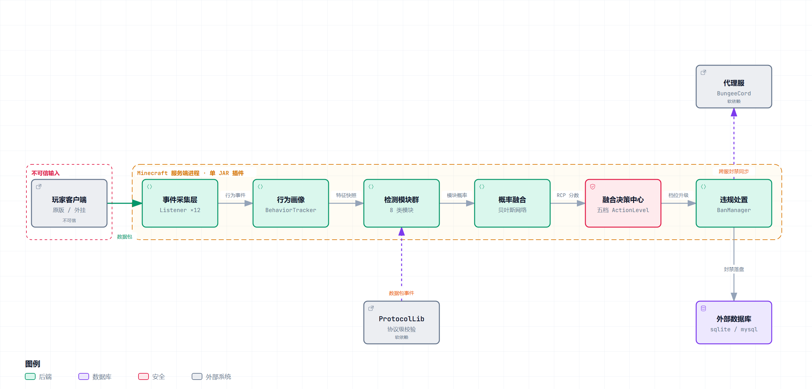
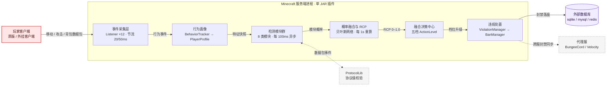

# AdvancedAntiCheat

[](https://github.com/cklsit/AdvancedAntiCheat/actions/workflows/ci.yml)
[](https://cklsit.github.io/AdvancedAntiCheat/)


适用于 **Minecraft 1.8.8 – 1.21.11** 服务端（Paper / Purpur / Spigot / FlamePaper）的高级反作弊插件：**一套源码编译，双版本运行**。

不只是阈值检测——AAC 构建了「**多层检测引擎 → 玩家画像 → 贝叶斯概率融合 → 五级智能处置**」的完整反作弊闭环：

- 🧠 **RCP 实时作弊概率**：多模块概率经贝叶斯网络融合，自适应学习调整权重，输出 NORMAL → MONITOR → CAPTCHA → TEMP_BAN → PERM_BAN 五级处置
- 🕵️ **八大类 40+ 检测项**：移动 / 战斗 / 挖掘建筑 / 背包物品 / 网络协议 / 客户端指纹 / 蜜罐陷阱 / 行为分析全项覆盖
- 👤 **玩家画像系统**：瞄准分析、挖矿模式、背包状态机、击键动力学、身份指纹、社交关联图谱与风险历史
- 🔐 **三套人工介入机制**：查端（客户端核实）、验证码（专用世界任务 + 动作模仿 DTW 判定）、漏洞赏金（白盒自测沙箱）
- 🌐 **跨服务器同步封禁**：SQLite / H2 / MySQL / MongoDB / Redis，配合 BungeeCord / Velocity 全服生效
- 🧩 **游戏内管理界面**：`/ac config` 多级箱子菜单，检测项开关 / 数据库 / 白名单 / 封禁管理全部游戏内完成并热更新
- 📝 **审计留痕**：融合决策的每一次自动处置（监控 / 验证码 / 临时封禁 / 永久封禁）都写入审计表，供事后追溯

---

## 🏗️ 架构总览



> 上图由 [archify](https://github.com/tt-a1i/archify) 从仓库真实代码生成，锚定提交 `5ae02ab`，含 13 处源码引用。
> （该提交下线了观察者回放与 Web 面板，图已同步移除「管理面板」「观察者容器」节点。）
>
> 🔎 **在线交互版**：<https://cklsit.github.io/AdvancedAntiCheat/architecture/anticheat-runtime-architecture.html>
> —— 可缩放 / 平移 / 搜索节点 / 追踪关系 / 切换深浅主题 / 导出 PNG·SVG（由 GitHub Pages 从 `docs/` 发布，[落地页](https://cklsit.github.io/AdvancedAntiCheat/)）
>
> 其余产物在 [`docs/architecture/`](docs/architecture/)：
> [JSON 规格](docs/architecture/anticheat-runtime-architecture.json)（可复现渲染）·
> [深色版 PNG](docs/architecture/anticheat-runtime-architecture-dark.png)
>
> GitHub 的 Markdown 清洗器只放行 `img / table / details` 等少量标签，`script`、`style`、`iframe`、`svg`、`picture` 均会被剔除，
> 因此交互版 HTML **无法直接嵌进 README**（只能外链）。下面折叠区是用 GitHub 原生 Mermaid 渲染的等价版本，可在页面内直接放大查看。

<details>
<summary>📐 原生渲染版架构图（GitHub 直接绘制 · 可点击放大 · 随深浅主题切换）</summary>



</details>

**主链路（唯一一条运行时路径）**

```
玩家数据包 → 事件采集层 → 行为画像 → 检测模块群 → 概率融合(RCP) → 融合决策中心 → 违规处置
```

| 阶段 | 关键实现 | 要点 |
|------|---------|------|
| 事件采集层 | `listeners/` 下 14 个 Listener + `DetectionCoordinator` | 移动/攻击事件节流 20/50ms，避免高频事件打满主线程 |
| 行为画像 | `BehaviorTracker` → `PlayerProfile` | 五大行为特征 + 瞄准/挖矿/背包/指纹/关联图，风险历史每小时衰减 |
| 检测模块群 | `AdvancedDetectionManager` + 8 类专项模块 | 每 **100ms** 异步跑全项检查（10Hz），TPS/CPU 超阈值自动降级 |
| 概率融合 | `ProbabilityFusionEngine` + `BayesianNetwork` + `RCPComputer` | 各模块概率融合成 RCP（0–1.0），每 1s 重算，叠加先验/延迟/趋势 |
| 融合决策中心 | `DecisionActionCenter` | `ActionLevel` 五档：0.5 / 0.75 / 0.95 / 0.995 分级，提示按档位升级 + 同档冷却防刷屏 |
| 违规处置 | `ViolationManager` → `BanManager` | 违规计数达阈值即封禁，落盘后跨服同步 |

**外部依赖与信任边界**

| 类型 | 对象 | 现状 |
|------|------|------|
| 🔴 信任边界 | 玩家客户端（全部输入不可信） | 事件节流 + `ProtocolValidator` 结构校验；白名单挂 `anticheat.bypass` 附件全局豁免 |
| 🟠 外部系统 | 外部数据库 | `database.type` 五选一：sqlite（默认）/ mysql / h2 / redis / mongodb |
| 🟠 外部系统 | 代理服 | 软依赖 BungeeCord / Velocity，实现跨服封禁同步与 `/goto` |
| 🟠 外部系统 | ProtocolLib | 软依赖，未安装时协议层检测自动降级 |

---

## 📋 前置依赖

插件启动时自动探测服务器版本，在 1.8.x 与 1.19+ API 之间选择兼容模式运行：

| 服务器类型 | 最低版本 | 推荐 / CI 验证版本 |
|-----------|---------|------------------|
| Paper / Purpur | 1.19+ | 1.21.11 |
| Spigot / FlamePaper | 1.8.x | 1.8.8 |

| 软依赖 | 说明 |
|--------|------|
| BungeeCord / Velocity | 跨服务器消息通道，用于跨服封禁同步与 `/goto` |
| ProtocolLib | 协议级检测（非法数据包结构、微时序、假方块）；未安装时相关检测自动降级，插件照常运行 |

---

## 🚀 安装方法

1. 下载最新版插件 JAR（[Releases](https://github.com/cklsit/AdvancedAntiCheat/releases)）
2. 将 JAR 放入服务端 `plugins` 目录
3. 启动服务器，插件自动生成配置：
   - `plugins/AdvancedAntiCheat/config.yml` — 主配置（检测项 / 数据库 / 验证码 / AI 实验室）
   - `plugins/AdvancedAntiCheat/checkclient.yml` — 查端文案
   - `plugins/AdvancedAntiCheat/messages.yml` — 玩家侧全部消息
4. 改完执行 `/ac reload`（**不要用 Bukkit `/reload`**：它会踢所有玩家下线）

---

## ✨ 功能特性

### 🔍 检测体系

**单项经典检测**（违规计数达阈值自动处置）：

| 检测项 | 说明 |
|--------|------|
| Fly | 飞行检测（支持创造模式排除） |
| Speed | 移动速度异常 |
| KillAura | 杀戮光环 |
| Reach | 攻击距离异常（NORMAL / MAX / ABSOLUTE 三级校验） |
| ESP | 透视 / 实体追踪 |
| FastBreak | 破坏方块速度异常 |
| Scaffold | 自动搭桥 |
| NoSlow | 使用物品未减速 |

**高级模块化检测**（八大分类，键名均为 `config.yml` 中 `detection.*` 配置项）：

| 分类 | 检测项 |
|------|--------|
| 一、移动类 | `timer`、`water_walk`、`high_jump`、`no_fall`、`spider`、`phase`、`jesus`、`clock_drift`（时钟漂移）、空中二段跳 / 不可能变向（`ImpossibleActionDetector`） |
| 二、战斗类 | `auto_hit`、`cps_anomaly`、`no_knockback`、`auto_totem`、`aim_angle`、`aimbot_spectrum`、`knockback_entropy`、`anti_knockback`、`auto_armor`、`auto_potion`；Aimbot 硬锁定识别（`AimbotHardLockDetector`）、CPS 限制器 |
| 三、挖掘与建筑 | `fast_break`、`auto_miner`（矿机模式，默认永久封）、`break_consistency`、`mining_coord`、`illegal_place`、`no_slow_mining` |
| 四、背包与物品 | `auto_stack`、`container_spam`、`item_move_spam`、`offhand_swap`、`inventory_dupe`（疑似复制，默认永久封） |
| 五、网络与协议 | `protocol_spoof`、`brand_spoof`、`malformed_packet`（需 ProtocolLib 增强） |
| 六、客户端指纹 | `gui_fingerprint`（GUI 响应延迟指纹）、`render_distance`（渲染距离验证矿透）、隐写特征物品追踪小号流转 |
| 七、蜜罐陷阱 | `x_ray`（幻象诱饵矿石）、`chest_esp`、`player_radar`、`tracer`、`fake_drop`、`fake_escape`（假逃脱重定向沙箱收集情报） |
| 八、行为分析 | `behavior_anomaly`（个人基线偏离）、`keystroke`（击键动力学）、`anti_recon`（反侦察）、`global_anomaly`（孤立森林全局异常） |

另有独立的 **物理模拟复算**（`PhysicsSimulator`，服务端重放客户端运动学验证位移合法性）与 **关联检测**（小号识别、团队作弊、设备指纹、社交图谱、行为相似度）。

### 🧬 核心层（`com.anticheat.core`）—— Grim 式内核

参照开源反作弊 [GrimAC](https://github.com/GrimAnticheat/Grim) 重构的独立内核，**Kotlin 编写**，与上面那套基于 Bukkit 事件的旧引擎**并存、互不依赖**（`core.enabled=false` 即整体退回旧体系）。

- **包层**：内嵌 PacketEvents 2.13.0，注入 Netty 通道，**一个 jar 覆盖 1.8.8 – 1.21.x**，不依赖 ProtocolLib 或服务端版本分支
- **分派**：`CheckManager` 在玩家接入时按接口类型把检测切成扁平数组，位置/朝向回调不做任何反射或 `instanceof`
- **检测框架**：`@CheckData` 注解携带「名字 / 衰减 / setback 阈值」，新增检测不需要改注册代码；`flag()` 是唯一违规入口
- **违规账本**：`ViolationData` 不依赖任何平台类型，可离线单测（`ViolationDataTest`）——`flag` 加分、`reward` 按 decay 扣分，保证真人分数能回落
- **失败即降级**：包层注入失败（非标准 Netty 管道、其它注入型插件冲突）时旧体系继续提供保护，而不是把插件拖死

内置 18 项检测（`core.checks.<名字>` 可逐项开关/调参）：

| 分组 | 检测 | 判据 |
|------|------|------|
| 协议 | `BadPacketsA` | 非法位移（NaN/Inf、单包位移超物理上限） |
| 协议 | `BadPacketsB` | 非法 pitch（越界 / NaN） |
| 协议 | `BadPacketsC` | 松开右键包携带非法作用面（原版恒为 DOWN） |
| 协议 | `BadPacketsD` | 连续上报相同手持槽位（原版只在变化时才发） |
| 背包 | `InventoryA` | 服务端未开窗却点击容器 |
| 背包 | `InventoryB` | 拾取后 100ms 内换入副手（自动图腾，1.9+） |
| 计时 | `TimerA` | 移动包持续快于原版（计时器加速，余额法） |
| 计时 | `TimerB` | 移动包连续长间隔（客户端攒包 / blink） |
| 自动点击 | `AutoClickerA` | 点击间隔标准差长期过低且稳定（1.13 以下） |
| 自动点击 | `AutoClickerB` | 点击间隔香农熵过低（1.13 以下） |
| 自动点击 | `AutoClickerC` | 每秒攻击次数超限；单 tick 多次攻击加重 |
| 瞄准 | `AimA` | 攻击期间朝向增量过于均匀（机械瞄准） |
| 射线 | `ReachA` | 攻击距离超原版上限（含 8 tick 延迟补偿，只累积不单次判定） |
| 射线 | `ReachB` | 攻击了完全不在视线内的实体（无视线攻击 / silent aura） |
| 战斗 | `NoSwingA` | 攻击了却没有挥手包（silent aura） |
| 战斗 | `ToolSwitchA` | 挖掘开始后 1 tick 内切换手持（自动换工具） |
| 世界 | `BreakRestartA` | 同一方块被反复重启挖掘（fastbreak / nuker） |
| 世界 | `FastPlaceA` | 同 tick 多次放置 / 每秒放置次数超限（fastplace） |

配置见 `config.yml` 的 `core:` 段。详见 [CODE_WIKI 3.7](CODE_WIKI.md#37-核心层core--grim-式内核)。

### 🧠 概率融合与智能决策

- `ProbabilityFusionEngine` + `BayesianNetwork` 融合各模块概率证据
- `RCPComputer` 计算玩家实时作弊概率（RCP），叠加先验、网络延迟与趋势分析
- `AdaptiveLearningSystem` 基于历史数据自适应调整各检测模块权重
- `DecisionActionCenter` 按 RCP 阈值输出五级处置；提示按「档位升级 + 同档冷却」门控，处罚动作不受节流影响
- `PerformanceMonitor` 监控 TPS / CPU / 内存，压力过大自动降级检测频次

### 🤖 AI 实验室（`com.anticheat.ai`）

48 维特征工程 → KMeans 个人基线 + 孤立森林全局异常 + 监督学习闭环 + PID 自适应阈值，融合分回注 `updatePlayerRCP`；`ailab.enabled=false` 即退回纯规则模式，数据落在 `dataFolder/ailab/`。

### 👤 玩家画像（profiles）

每位玩家维护长期档案：移动 / 战斗 / 挖矿 / 背包 / 社交五大行为特征、瞄准平滑度分析、挖矿时间规律、背包状态机、操作节奏（`TimerDetection`）、身份指纹（历史 ID / IP / 客户端版本 / 语言 / 硬件）、账号关联图与风险历史（每小时衰减），为决策中心提供长程上下文，可在游戏内 GUI（`/ac profile`）查看。

### 🧩 验证码系统

- `/captcha <玩家|toggle|timelimit>` — 对玩家发起验证码测试，支持新玩家自动验证
- 玩家进入**专用验证码世界**（自定义 chunk generator），从 `captcha.tasks.*` 启用的题库中**随机抽 1 项**：
  - `TypeA_DirectInteraction` — 注视指定颜色的羊 + 潜行
  - `TypeB_MotionMimicry` — 随机 3~4 步动作序列（跳跃 / 左右转 / 疾跑 / 潜行，不连续重复），按序号打在聊天框，由 `DtwMatcher`（DTW）对齐判定，**只看做了哪些动作与顺序，时长不参与**
- 判定通过即放行；失败会重新出题，连续失败达阈值由决策中心升级处置
- 动作识别阈值刻意放宽（`min-action-ms 150` / `turn-commit-degrees 30` / `min-move-blocks 0.5`），宁可放过误触也不误杀真人

### 🔐 查端系统（客户端核实）

- `/checkclient <玩家> <QQ号>` — 开始客户端检查，被检玩家限制移动 / 交互 / 指令 / 聊天、施加失明、显示自定义标题与聊天消息
- `/checkdone <玩家>` — 结束检查（通过）
- 超时或中途退出 → 自动永久封禁
- 文案、超时时间全部可在 `checkclient.yml` 自定义（支持 `{vault_group}` `{admin}` `{qq}` `{timeout}` 变量）

### 💰 漏洞赏金系统

| 任务类型 | 描述 | 时间限制 |
|----------|------|----------|
| `MOVE_BASIC` | 基础移动测试（A → B） | 3 分钟 |
| `MOVE_ADVANCED` | 高级移动测试（空中直角变向） | 5 分钟 |
| `COMBAT_BASIC` | 基础战斗测试（击杀僵尸） | 5 分钟 |
| `COMBAT_ADVANCED` | 高级战斗测试（杀戮光环检测） | 5 分钟 |
| `INVENTORY_CHALLENGE` | 物品栏挑战（快速切换物品） | 3 分钟 |
| `FREE_TEST` | 自由测试（给予所有道具与怪物） | 10 分钟 |

任务结束自动评估：**DETECTED**（检测到作弊）/ **BYPASSED**（无检测且无可疑行为）/ **ZERO_DAY**（无检测但有可疑行为，高危发现）。

### ⚖️ 封禁与举报

- 按违规严重程度自动封禁（临时 1 分钟 ~ 永久），支持踢出阈值与人工审核升级阈值，封禁界面可在 `messages.yml` 自定义
- `/report <玩家> <原因>` — 玩家举报，管理员收到**带「前往举报者」按钮**的通知，举报记录可用 `/ac reports` 查看

### 🛠️ 游戏内配置界面

`/ac config` 提供多级箱子菜单：在线玩家列表、玩家详情（封禁 / 查证 / 发送验证码）、封禁名单与解封均可游戏内完成；`anticheat.whitelist` 持有者可在同一界面维护可信白名单（白名单玩家不做反作弊封禁）。

---

## 📖 指令说明

### 玩家指令

| 指令 | 说明 | 权限 |
|------|------|------|
| `/report <玩家> <原因>` | 举报作弊玩家 | `anticheat.report`（默认开放） |
| `/bounty ...` | 漏洞赏金计划 | `anticheat.bounty`（默认开放） |
| `/ac` / `/anticheat` | 查看插件信息 | 无 |

### 管理员指令

| 指令 | 说明 | 权限 |
|------|------|------|
| `/ban <玩家> [时间] [原因]` | 封禁玩家（默认永久，跨服同步） | `anticheat.ban` |
| `/unban <玩家>` | 解封玩家 | `anticheat.unban` |
| `/goto <玩家>` | 传送至指定玩家（支持跨服） | `anticheat.goto` |
| `/checkclient <玩家> <QQ号>` | 开始客户端检查 | `anticheat.checkclient` |
| `/checkdone <玩家>` | 结束客户端检查（通过） | `anticheat.checkclient` |
| `/captcha <玩家\|toggle\|timelimit>` | 验证码测试 | `anticheat.captcha` |
| `/bounty enter\|leave\|invite\|report\|lb\|start\|complete` | 赏金沙箱管理 | `anticheat.bounty` / `.bounty.admin` |
| `/ac reload` | 重新加载配置 | `anticheat.admin` |
| `/ac stats` / `/ac reports` | 检测统计 / 待处理举报 | `anticheat.admin` |
| `/ac profile <玩家>` | 查看玩家档案 GUI | `anticheat.admin` |
| `/ac config` | 游戏内管理界面 | `anticheat.config` |
| `/ac help` | 列出全部命令 | `anticheat.admin` |

> 注意：Paper 1.8.8 控制台执行命令**不能带前导斜杠**（写 `ac help` 而非 `/ac help`）。

## 🔐 权限节点

| 权限 | 说明 | 默认值 |
|------|------|--------|
| `anticheat.report` | 使用举报功能 | ✅ true |
| `anticheat.bounty` | 使用漏洞赏金 | ✅ true |
| `anticheat.bounty.admin` | 赏金计划管理员 | 🔒 op |
| `anticheat.bounty.unlimited` | 无限制沙箱时间 | 🔒 op |
| `anticheat.goto` | 传送至玩家 | 🔒 op |
| `anticheat.ban` / `anticheat.unban` | 封禁 / 解封 | 🔒 op |
| `anticheat.checkclient` | 客户端检查 | 🔒 op |
| `anticheat.captcha` | 验证码功能 | 🔒 op |
| `anticheat.admin` | 反作弊管理员 | 🔒 op |
| `anticheat.notify` | 接收举报通知 | 🔒 op |
| `anticheat.config` | 游戏内配置界面 | 🔒 op |
| `anticheat.whitelist` | 维护可信白名单 | 🔒 op |

---

## 🗄️ 数据库配置

在 `config.yml` 中配置数据库（跨服部署时所有节点使用同一后端即自动同步封禁）：

```yaml
database:
  type: "sqlite"  # 支持: sqlite, h2, mysql, mongodb, redis
  server-name: "Server-1"
  sqlite:
    path: "anticheat.db"
  mysql:
    host: "localhost"
    port: 3306
    database: "anticheat"
    username: "root"
    password: ""
```

审计日志同样持久化到该数据库。**生产环境请勿在 `config.yml` 中明文存放数据库凭据**，建议使用最小权限账号并限制数据库访问来源。

## 📝 自定义查端配置

```yaml
checkclient:
  title: "§c您正在被管理员查端!"
  subtitle: "§e请看聊天框继续下一步"

  chat_message:
    - "§8§m------------------------------------------------"
    - "§f您已被 §b{vault_group} §f成员 §c§l冻结所有操作."
    - "§f请在 §b{timeout} §f分钟内添加 §c{admin} §f的 §bQQ §f好友 §a{qq} §f进行客户端核实。"
    - "§f请不要退出此房间或关闭游戏,否则您的账号将会被封禁！"
    - "§8§m------------------------------------------------"

  timeout_minutes: 60
```

**可用变量**：`{vault_group}`（管理员权限组）、`{admin}`（管理员名称）、`{qq}`（管理员 QQ 号）、`{timeout}`（超时分钟）

---

## 📁 项目结构

```
AdvancedAntiCheat/
├── src/main/java/com/anticheat/          # 159 个 Java 文件 + 43 个 Kotlin 文件
│   ├── AdvancedAntiCheat.java            # 主插件类（生命周期编排）
│   ├── core/                             # 【Grim 式内核 · Kotlin】平台抽象/事件总线/Check 框架/包层
│   │   ├── platform/                     #   Bukkit 解耦（PlatformLoader + Bukkit 实现）
│   │   ├── manager/                      #   三段式生命周期（load/start/stop）+ CheckManager 分派
│   │   ├── check/                        #   @CheckData 注解驱动 + ViolationData 违规账本
│   │   └── events/packets/               #   PacketEvents 监听入口（Netty 包层）
│   ├── detection/                        # 旧检测系统（与 core 并存）
│   │   ├── core/                         #   模块抽象基座（DetectionModule/DetectionResult/Evidence）
│   │   ├── fusion/                       #   概率融合与决策（贝叶斯 / RCP / 五级处置）
│   │   └── movement|combat|physics|association|network|
│   │       behavior|fingerprint|inventory|mining|timer/   # 各专项检测
│   ├── profiles/                         # 玩家画像（行为追踪 / 瞄准 / 矿机 / 背包状态机 / 指纹）
│   ├── managers/                         # 业务管理器（封禁 / 举报 / 查端 / 检测编排 / 审计）
│   ├── ai/                               # 48 维特征 / IsolationForest / 在线 KMeans（AI 实验室）
│   ├── captcha/ | bounty/                # 验证码世界（含 DTW 判定） / 漏洞赏金沙箱
│   ├── commands/ | listeners/ | gui/     # 9 命令、12 监听器、档案 GUI、配置 GUI
│   ├── repositories/                     # SQL(SQLite/H2/MySQL) / Mongo / Redis 数据访问层
│   └── compat/ | utils/ | integration/   # 1.8↔1.21 兼容层 / 工具 / ProtocolLib 钩子
├── src/main/resources/                   # config.yml / checkclient.yml / messages.yml
├── src/test/                             # JUnit 测试（12 个测试类：DTW 判定、融合决策门控、配置契约、违规账本等）
├── deploy/nas-minecraft/                 # 群晖 DSM 部署脚本
├── docs/                                  # GitHub Pages 站点（index.html 落地页 + .nojekyll）
│   └── architecture/                      #   本 README 架构图（spec / 交互 HTML / PNG）
├── tools/                                # 双版本审计与 CI 复用的质量工具
├── .github/workflows/                    # CI：矩阵构建 + 双版本 E2E
├── plugin.yml                            # 插件元数据、10 命令、13 权限节点
└── pom.xml                               # Maven 构建（Kotlin + Shade 重定位）
```

> 更详细的模块说明见 [CODE_WIKI.md](CODE_WIKI.md)。

---

## 🧪 质量门禁（CI/CD）

单入口流水线 [`.github/workflows/ci.yml`](.github/workflows/ci.yml)，6 个 Job：

```
unit-tests（paper + spigot 双矩阵）
   └─ package（shade fat-jar）
        ├─ compat-audit（1.21 编译 / 1.8.8 字节码兼容判定）
        └─ e2e（真机启动 1.8.8 与 1.21.11，端口 25599/25611）
             └─ change-gate（diff ↔ feature_map.json 功能门禁）
                  └─ quality-gate（汇总）
```

- **双版本铁律**：Paper 1.21.11 编译、FlamePaper 1.8.8 运行。禁止 `event.getView()`、`Entity.setGravity` 等跨版本不兼容调用，材质一律走 `VersionUtil.compatMaterial`；改动后跑 `tools/audit_dual_version.py` 对**刚打包的 jar** 做字节码判定
- **功能变更三处同步**：测试类 → `tools/ci/feature_map.json` → `tools/ci/server_e2e.py`，否则 change-gate 红
- 另有 `test-dispatch.yml`（手动触发测试）

---

## 🛠️ 开发说明

### 环境要求

- **JDK 21+**（paper-api 1.21.11 要求，也是本项目的**编译目标**：`maven.compiler.target=21` + Kotlin `jvmTarget=21`）
- **运行环境同样是 Java 21**，即使是 1.8.8 服务端
- Maven 3.8+

> ⚠️ **「1.8.8 / 1.21」指 Minecraft 服务端版本，不是 JVM 版本。两个服务端版本都跑在 Java 21 上**（生产服为 `mcjava21`，CI 也是 JDK 21 跑双版本 E2E）。
> 因此用 JRE 8 去启动 1.8.8 服务端会得到 `UnsupportedClassVersionError: class file version 65.0` —— 这是 JVM 选错，不是代码不兼容。

### 编译项目

```bash
mvn clean package                          # 默认 -Ppaper（Paper 1.21.11 API）
mvn clean package -Pspigot                 # Spigot 1.8.8 API 变体
```

构建产物为 `target/AdvancedAntiCheat-2.1.0.jar`（fat-jar，第三方依赖已重定位到 `com.anticheat.libs.*`），直接放入服务端 `plugins/`。

---

## ⚠️ 已知限制

1. **举报内容未校验**：`/report` 的 `reason` 无长度与字符限制，会直接广播给 `anticheat.notify` 玩家并落盘，公网服务器建议加前置过滤
2. **依赖 Bukkit `/reload` 不安全**：重载请用 `/ac reload` 或重启服务端
3. **静默吞异常约 40 处**：`catch (Throwable ignored) {}` 多为 1.8 / 1.21 跨版本防御，但背包还原、文件写入等路径完全无日志，故障时不可观测
4. 仓库根目录仍存有大量 NAS 部署期的临时 Python/PowerShell 脚本与截图，待归档至 `tools/`

---

## 📄 许可证

本项目使用 MIT 许可证，详见 [LICENSE](LICENSE)。

## 🤝 贡献

欢迎提交 Issue 和 Pull Request。提交前请确保：

- `mvn clean package` 通过
- 新增/修改功能已同步测试、`tools/ci/feature_map.json` 与 `tools/ci/server_e2e.py`
- 涉及检测逻辑的改动附上阈值标定数据或回归测试

---

**保护您的服务器免受作弊侵害！** 🛡️
